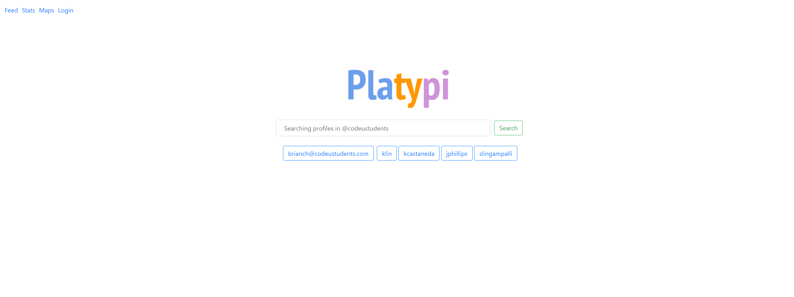
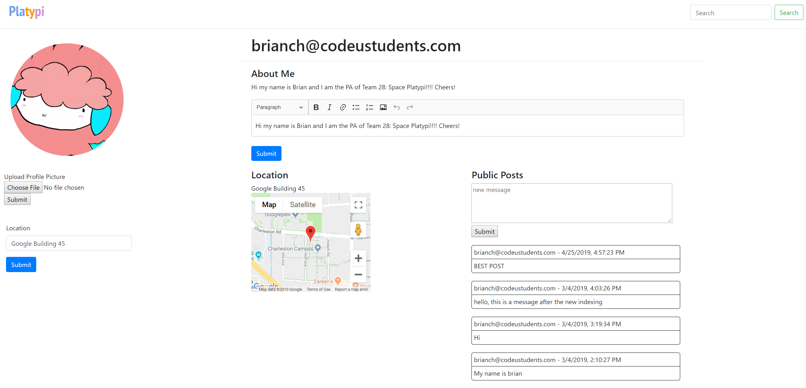

# Team Space Platypi  

New Repo Here: https://github.com/fluffysheep-codeu/Spring2019-TeamSpacePlatypi

### Overview

We like to think of this web app like social media backwards. Instead of making connections based off of who you know, you search the different communities you are a part of for interests, hobbies, classes, etc. that you share with others. If you and another person share an interest and a community, you can connect to grow in together in that aspect in a shared platform!

### Details
* Google CodeU Spring 2019 Student Project
* Deployed at https://sp19-codeu-28-4865.appspot.com/
* Project Advisor: Brian Chen
* Team: Karen Lin, Kendall Castañeda, Prudence Phillips, Sriya Lingampalli

### Project Pictures

### Setup
* Javac Version 1.8.0+
* Maven 3.60+

### Running a Development Server
`mvn appengine:devserver`

### Deployment
`mvn appengine:update`
